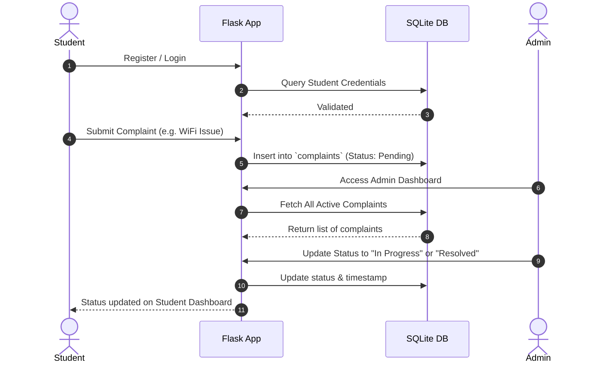

# 🏛️ Digital Complaint Management System

[](https://ChiranthanNS.github.io/Digital_Complaint_Management_System/)
[](https://www.python.org/)
[](https://flask.palletsprojects.com/)
[](https://sqlite.org/)

A modern, responsive, and secure web application designed to streamline the student grievance and complaint resolution process within educational institutions. 

This repository contains two implementations:
1. **🌐 Live Static App:** A pure client-side SPA (Single Page Application) that runs directly on GitHub Pages, storing data locally via browser `localStorage`.
2. **🐍 Python Flask App:** A full-stack Python application powered by Flask and SQLite database (located in the `/flask-app` folder).


---

## 🛠️ Features & User Roles

### 🎓 For Students
- **Account Management:** Easy signup and login using hashed password authentication.
- **Grievance Submission:** File complaints categorized by issue types (e.g., WiFi, Water, Electrical, Classroom, etc.) with priority levels.
- **Real-Time Tracking:** Track complaint status (`Pending` ➡️ `In Progress` ➡️ `Resolved`).
- **Control & Ownership:** Edit or delete complaints *only* while they are in the `Pending` status.

### 👑 For Administrators
- **Executive Dashboard:** Live analytical views showing total, pending, in-progress, and resolved complaints, along with category-wise statistics.
- **Filters & Search:** Quick search by title, description, or student name. Filter by category or status.
- **Resolution Control:** Promote status through stages (`Pending` -> `In Progress` -> `Resolved`) or delete complaints entirely.

---

## 🔄 System Architecture

The following diagram illustrates the workflow of submitting, tracking, and resolving a student complaint:



---

## 📁 Repository Structure

```
ComplaintManagement/
├── assets/                    # Static Application Assets
│   ├── css/
│   │   └── style.css          # Main CSS Stylesheet
│   ├── js/
│   │   └── app.js             # Client-side SPA Application Logic
│   └── hero_banner.png        # System Screenshot Banner
├── flask-app/                 # Python Flask Fullstack Implementation
│   ├── backend/               # Flask Backend Server & SQLite
│   │   ├── database/
│   │   │   ├── complaint_db.db
│   │   │   └── complaint_db.sql
│   │   ├── tests/
│   │   │   └── test_student_actions.py
│   │   ├── app.py
│   │   ├── init_sqlite.py
│   │   └── requirements.txt
│   └── frontend/              # HTML Templates & Styles
│       ├── static/
│       └── templates/
├── index.html                 # Main Entrypoint for GitHub Pages SPA
└── .gitignore
```

---

## 🚀 Getting Started

### 📋 Prerequisites
Make sure you have **Python 3.10+** and **pip** installed.

### 🔧 Installation & Setup

1. **Clone the repository:**
   ```bash
   git clone https://github.com/ChiranthanNS/Digital_Complaint_Management_System.git
   cd Digital_Complaint_Management_System/ComplaintManagement
   ```

2. **Set up a virtual environment (optional but recommended):**
   ```bash
   python -m venv .venv
   # On Windows:
   .venv\Scripts\activate
   # On macOS/Linux:
   source .venv/bin/activate
   ```

3. **Install dependencies:**
   ```bash
   pip install -r flask-app/backend/requirements.txt
   ```

4. **Initialize the Database:**
   *Note: A pre-configured database is included, but you can build a fresh database using the SQL schema if needed:*
   ```bash
   python flask-app/backend/init_sqlite.py
   ```

---

## 🖥️ Running the Flask Application

1. **Start the Flask server:**
   ```bash
   python flask-app/backend/app.py
   ```
2. **Access the application in your browser:**
   - **Student Portal:** [http://127.0.0.1:5000](http://127.0.0.1:5000)
   - **Admin Dashboard:** [http://127.0.0.1:5000/admin/login](http://127.0.0.1:5000/admin/login)

### 🔑 Default Credentials
To access the Admin Portal, use the following seeded account:
- **Username:** `admin`
- **Password:** `admin123` *(automatically hashed on the first application startup)*

---

## 🧪 Running Unit Tests
A suite of unit tests is included to verify the application's core logic and routes (especially the restricted student action guards):
```bash
cd flask-app
python -m unittest backend/tests/test_student_actions.py
```
